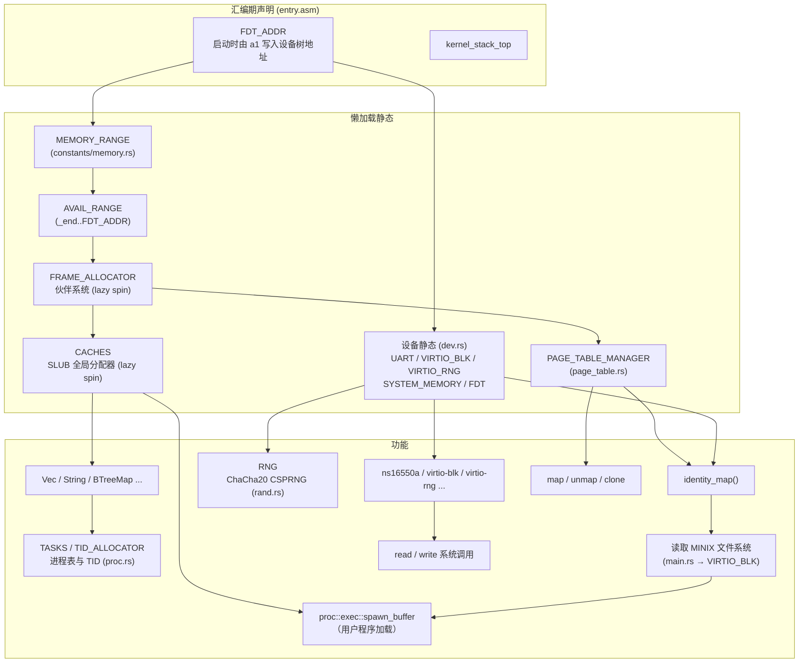

# Athera

一个用 Rust 编写的简易 RISC-V 64 操作系统。

## 特性

- 目标平台：`riscv64gc-unknown-none-elf`，QEMU `virt` 机型（当前单核，`config.toml` 中 `smp = "UP"`）
- 通过 SBI 与底层交互（srst 系统复位/重启、hsm 停止 hart、legacy 控制台、DBCN 调试控制台等）
- UART 驱动：ns16550a，基于设备树自动探测
- 块设备驱动：virtio-blk（MMIO 模式，含 virtio-mmio 传输层、链式握手状态机与通用 `VirtioDevice` 抽象）
- 熵源驱动：virtio-rng（MMIO 模式，为随机数提供真随机种子）
- 随机数：`athera-rand` 提供 ChaCha20 CSPRNG，内核全局 `RNG` 经 virtio-rng 种子化（无设备时回退固定种子并告警）
- MINIX 文件系统：启动时从 virtio-blk 读取 MINIX V1 文件系统（超级块、inode、目录项），按路径查找并执行 `/bin/hello_world`、`/bin/sort`（`fs/minix_fs.rs`，镜像可用 `minix_put.py` 写入）
- 磁盘索引：自定义 512 字节索引块格式，`mkdisk.py` 可读写（`fs/record.rs`，`File` 含 `start_block` / `size_bytes` / `name`）
- 内存管理：等值映射页表、内核/用户地址空间分离（Sv39）、伙伴系统物理页帧分配器、SLUB 全局分配器
- 陷阱处理与用户态上下文恢复（`TrapContext` / `restore_context`），S 模式定时器中断（10 Hz）
- ELF 加载器：解析 ELF64 程序头，逐段拷贝 `PT_LOAD` 并建立用户映射与栈（`add` 经 `include_bytes!` 内嵌为 `EMBEDDED_ELF`）
- 用户态进程管理与 ecall 系统调用（read / write / exit / reboot / fork）
- TID 分配器（`athera-id-alloc`）
- 同步原语：`SpinLock`（关中断自旋锁）/ `OnceLock` / `LazyLock`（懒加载静态）/ `PerCpu`（每 hart 存储）
- 日志宏：`trace!` / `debug!` / `info!` / `warn!` / `error!`
- 构建时配置（`config.toml`）与可选 `halt_directly` feature（停机时直接经 SBI 关机）

## 工作区结构

```
athera/                       # 内核（根 crate）
├── src/
│   ├── arch/               RISC-V 相关
│   │   ├── registers/      csr / gpr / values（寄存器抽象）
│   │   └── sbi.rs          SBI 封装（base / time / ipi / rfence / hsm / srst / legacy / dbcn）
│   ├── boot.rs            启动编排（从磁盘加载用户程序）
│   ├── constants/          常量模块
│   │   ├── memory.rs       内存常量与懒加载范围（MEMORY_RANGE 等）
│   │   ├── symbols.rs      链接器符号（_end / trap_entry / user_trap_entry / FDT_ADDR）
│   │   ├── elf.rs          内嵌用户程序 ELF（EMBEDDED_ELF / add）
│   │   ├── task.rs         任务常量（TID_MAX）
│   │   ├── uname.rs        版本信息
│   │   └── virtio.rs       virtio 常量
│   ├── dev/                设备驱动
│   │   ├── device.rs       设备抽象（MMIO Resource / Device / mmio_regs!）
│   │   ├── traits.rs       CharDevice / BlockDevice trait
│   │   ├── ns16550a.rs     UART 驱动
│   │   ├── memory.rs       内存区域探测
│   │   ├── virtio_blk.rs   virtio-blk 驱动
│   │   ├── virtio_rng.rs   virtio-rng 熵源驱动
│   │   ├── virtio_mmio.rs  virtio-mmio 传输层（VirtioDevice trait / VirtqCfg）
│   │   └── virtio_mmio/    virtio-mmio 子模块
│   │       ├── handshake.rs  链式握手状态机
│   │       └── queue.rs      虚拟队列
│   ├── mem/                内存管理
│   │   ├── addr.rs         地址位域抽象（Sv39）
│   │   ├── frame.rs        物理页帧句柄（Frame）
│   │   ├── allocators/     伙伴系统、SLUB 全局分配器、侵入式链表
│   │   └── page_table/     页表（内核/用户地址空间）
│   │       └── handle.rs   页表句柄
│   ├── entry.asm           启动汇编（_start / 内核栈 / FDT_ADDR 声明）
│   ├── fs/                文件系统
│   │   ├── minix_fs.rs    MINIX V1 文件系统（模块根：MinixFs 核心 / 位图分配 / 再导出）
│   │   ├── minix_fs/      MINIX V1 子模块
│   │   │   ├── types.rs    磁盘结构（SuperBlock / DINode / DirEntryRaw / Mode / 魔数）
│   │   │   ├── path.rs     路径类型（Path / PathBuf / Component）
│   │   │   ├── dir.rs      目录项与按需读取迭代器（DirEntries）
│   │   │   ├── file.rs     打开的文件（File 读写）
│   │   │   ├── write.rs    写路径（创建/删除、硬链接、符号链接、目录）
│   │   │   └── open.rs     目录读取与路径解析（open / resolve_path）
│   │   └── record.rs      磁盘索引块（RecordString / File / Index，File 含 start_block / size_bytes / name）
│   ├── rand.rs             全局随机源（ChaCha20 CSPRNG）
│   ├── sync/               同步原语
│   │   ├── spin.rs         SpinLock（关中断自旋锁）
│   │   ├── once.rs         OnceLock（一次性初始化）
│   │   ├── lazy.rs         LazyLock（懒加载静态）
│   │   └── per_cpu.rs      PerCpu（每 hart 存储）
│   ├── proc.rs             进程管理
│   │   ├── task.rs         任务控制块、TID 分配与任务表
│   │   ├── exec.rs         ELF 用户程序加载执行
│   │   └── sched.rs        任务切换
│   ├── trap.rs             陷阱处理与用户态上下文、定时器
│   ├── syscall.rs          系统调用
│   ├── elf.rs              ELF 结构定义
│   ├── io.rs               控制台输出层（print!/println! / getchar，fmt::Write 实现在 dev/ns16550a）
│   ├── log.rs              分级日志（trace!/debug!/info!/warn!/error!）
│   ├── macros.rs           宏定义（bits!/numeric!/mmio_regs!/array_struct!）
│   ├── error.rs            错误类型
│   └── main.rs             内核入口
├── crates/                  工作区子 crate
│   ├── athera-userland/     用户程序
│   │   ├── src/
│   │   │   ├── bin/         hello_world.rs / add.rs / sort.rs
│   │   │   ├── lib.rs       入口 _start
│   │   │   ├── syscall.rs   用户态 ecall 封装
│   │   │   ├── stdio.rs     print!/println!（经 write 系统调用）
│   │   │   ├── panic.rs
│   │   │   └── linker.ld
│   │   └── build.rs
│   ├── athera-macros/        内核属性/派生宏与编译期常量（const_val / lazy / spin / Id）
│   ├── athera-macros-impl/   proc-macro crate（const_val / lazy / spin / Id）
│   ├── athera-id-alloc/     ID 分配器（用于 TID）
│   ├── athera-bitmap/       no_std 定长位图（空闲位查找 / 按位操作）
│   └── athera-rand/         no_std 随机数库（ChaCha20 / xoshiro256**）
├── linker.ld               内核链接脚本
├── config.toml             构建时配置
├── build.rs
└── scripts/
    ├── mkdisk.py           磁盘索引镜像写入脚本（见“磁盘索引格式”）
    ├── put_userland.sh     构建并把用户程序复制到 MINIX 镜像 /bin/（见“MINIX 文件系统”）
    └── start.sh            QEMU 启动脚本
```

## 构建与运行

依赖：

- Rust nightly（edition 2024）
- `qemu-system-riscv64`

构建并启动（用户程序 ELF 会在编译期通过 `include_bytes!` 内嵌进内核，须先构建）：

```bash
# 先构建用户程序
cargo build -p athera-userland --release

# 构建内核并启动
cargo build --release
./start.sh
```

可选：启用 `halt_directly` feature 后，`kernel_halt()` 会直接通过 SBI 关机而不是空转：

```bash
cargo build --release --features halt_directly
```

调试构建（`debug_assertions`）默认日志级别为 `TRACE`，发布构建为 `INFO`。

`start.sh` 选项：

| 选项 | 作用 |
| ---- | ---- |
| `-s` | 启用 GDB 调试（`-s -S`）|
| `-i` | 输出中断日志 |
| `-m` | 输出 MMU 日志 |
| `-p` | 挂载 virtio-blk PCI 磁盘（`resources/disk.qcow2`）|
| `-d` | 挂载 virtio-blk MMIO 磁盘（`resources/minix.qcow2`）|
| `-r` | 添加 virtio-rng（MMIO 熵源）设备，建议放在 `-d` / `-p` 之后 |
| `-b` | 使用 GTK 显示（`-display gtk` + ramfb）|

> `-r` 需配合 `-d` / `-p` 使用并放在其后，保证 virtio-blk 仍是第一个 `virtio,mmio` 节点（内核探测时只匹配第一个同类节点）。

示例：

```bash
./start.sh -p          # 带 PCI 块设备启动
./start.sh -s -i       # 调试 + 中断日志
./start.sh -b -d -r    # GTK 图形界面 + MMIO 磁盘 + virtio-rng
```

## MINIX 文件系统

内核启动时从 virtio-blk 读取 MINIX V1 文件系统（`src/fs/minix_fs.rs`）：解析超级块（`SuperBlock`）、磁盘 inode（`DINode`）与目录项（`DirEntryV1_14` / `DirEntryV1_30`，根据魔数 `0x137F` / `0x138F` 区分文件名长度 14 / 30），通过 `MinixFs::open` 按路径逐级查找并顺序读取文件内容，再交给 `proc::exec::spawn_buffer` 加载执行。写路径支持创建文件（`create_file`）、读写（`File::write` / `write_at`，自动分配数据块并维护直接/一级/二级间接块），inode 与数据块位图用 `athera-bitmap` 的 `BitMapView` 零拷贝维护（`alloc_inode` / `free_inode` / `alloc_zone` / `free_zone`），并支持硬链接（`link`）、删除（`unlink` / `remove`，链接数归零时释放数据块与 inode）、目录创建/删除（`create_dir` / `remove_dir`，仅空目录）与符号链接（`symlink`，目标路径存放在数据块中）；`open` 解析路径时自动解引用符号链接（含嵌套与相对/绝对目标，循环检测上限 40 跳）；路径类型 `Path` / `PathBuf` 仿标准库（`parent` / `file_name` / `extension` / `join` / `components` / `push` / `pop` 等），打开的文件 `File` 携带路径并支持 `path()` / `name()`；写入结果可通过 `fsck.minix` 校验。

启动时会依次加载并执行磁盘上的 `/bin/hello_world` 与 `/bin/sort`，最后执行编译期内嵌的 `add`。`-d` 选项挂载的 `resources/minix.qcow2` 即为 MINIX 文件系统镜像。

把用户程序复制到该镜像的 `/bin/` 目录下（依赖 libguestfs 的 `guestfish`，会自动构建 `athera-userland`）：

```bash
./scripts/put_userland.sh              # 构建并写入全部 [[bin]]（hello_world / add / sort / panic）
./scripts/put_userland.sh -n           # 不重新构建，直接用现有 ELF
./scripts/put_userland.sh -i disk.img  # 指定其他镜像
```

## 磁盘索引格式

块设备首块（块号 0）是一个 512 字节的索引块（`src/fs/record.rs`），是内核自带的另一种简单磁盘格式，由 `mkdisk.py` 工具读写：

- `Index`：21 个 `File` 条目 + 末尾 8 字节 `next_index`（预留的下一个索引块号）
- `File`（24 字节）：`start_block`（起始块号，u32）+ `size_bytes`（文件字节数，u32）+ `name`（定长 16 字节文件名 `RecordString`，遇 NUL 截断）
- 空条目（`start_block == 0 && size_bytes == 0`）表示未使用

`mkdisk.py` 可以把宿主机文件按上述格式写入虚拟磁盘镜像（默认读写 **qcow2**，即 `start.sh` 使用的格式；对已有镜像自动识别格式，也可用 `--format raw` 改用原始镜像）。写入时自动按 512 字节块对齐、分配连续块；文件数超过 21 时自动链式追加索引块：

```bash
python3 mkdisk.py resources/disk.qcow2 hello.txt a.out    # 重建索引并写入（新镜像按 --size 创建，默认 128M）
python3 mkdisk.py --append resources/disk.qcow2 more.txt  # 保留原有文件，追加（同名文件视为替换）
python3 mkdisk.py --list resources/disk.qcow2             # 查看镜像当前索引
python3 mkdisk.py --format raw disk.img hello.txt         # 改用原始 raw 镜像
```

qcow2 由脚本内置的纯 Python 读写器生成/解析（v3、64K 簇、16 位引用计数、无压缩/快照/加密），不依赖 `qemu-img`。

## 系统调用

| 编号 | 系统调用 | 描述 |
| ---- | -------- | ---- |
| 63   | read     | 从 UART 读取 |
| 64   | write    | 向 UART 写入 |
| 93   | exit     | 退出用户程序 |
| 95   | waitpid  | 等待子进程（未实现）|
| 142  | reboot   | 重启/关机/停机 |
| 220  | fork     | 创建子进程（克隆地址空间与陷阱上下文）|
| 221  | exec     | 执行新程序（未实现）|
| 222  | mmap     | 映射内存（`todo!()`，尚未实现）|
| 223  | munmap   | 解除映射（`todo!()`，尚未实现）|
| 224  | mremap   | 重映射（`todo!()`，尚未实现）|

> `fork` 目前为最小实现：分配新 TID、克隆页表（`PageTableManager::clone`）与全部物理页（逐页 `copy`），子进程 `a0 = 0` 并从 `sepc + 4` 继续执行，随后直接切换到子进程。`waitpid` / `exec` 未显式处理，返回 `ENOSYS`。

## 初始化依赖

内核大量使用 `LazyLock`（经 `athera-macros` 的 `#[lazy]` / `#[lazy(spin)]` 宏生成）实现懒加载静态。
各静态首次通过 `.force()` 访问时按需初始化，其依赖关系如下：



- **汇编期声明**：`entry.asm` 中 `_start` 在 `.data`/`.bss` 段预留了 `FDT_ADDR`、内核/用户栈及 virtio 队列区；`FDT_ADDR` 在启动时由寄存器 `a1` 写入设备树物理地址，供 Rust 侧作为 `extern` 符号读取。
- `MEMORY_RANGE` 与 `dev.rs` 中的 `UART` / `VIRTIO_BLK` / `VIRTIO_RNG` / `SYSTEM_MEMORY` / `FDT` 均依赖启动时由汇编写入的 `FDT_ADDR`（设备树地址）。`FDT` 初始化完成后会把设备树拷贝进堆中并把 `FDT_ADDR` 指向新副本，同时把原设备树所占物理内存归还给伙伴系统。
- `FRAME_ALLOCATOR`（伙伴系统）以 `AVAIL_RANGE`（内核末尾 `_end` 到 `FDT_ADDR`）作为可用物理页范围。
- `PAGE_TABLE_MANAGER` 与 `CACHES`（SLUB 全局分配器）均需先分配物理页帧，故依赖 `FRAME_ALLOCATOR`。
- 一旦 `CACHES` 就绪，`Vec` / `String` / `BTreeMap` 等 `alloc` 结构以及基于它们的 `TASKS` 进程表、`TID_ALLOCATOR` 方可使用。
- `RNG`（`rand.rs`）首次访问时用 `VIRTIO_RNG` 提供的真随机字节种子化 ChaCha20 CSPRNG；若没有 virtio-rng 设备则回退固定种子并打印警告。
- MINIX 文件系统：`identity_map()` 完成后，`main` 通过 `VIRTIO_BLK` 读取 MINIX 超级块（偏移 1024）、根 inode 与目录项，按路径查找并加载执行磁盘上的用户程序。
- 定时器：`main` 启动时以及每次 S 模式定时器中断都会调用 `set_next_timer()` 重设 `stimecmp`（10 Hz），实现周期性的定时器中断。

## 许可证

GPL-3，详见 [LICENSE](LICENSE)。
