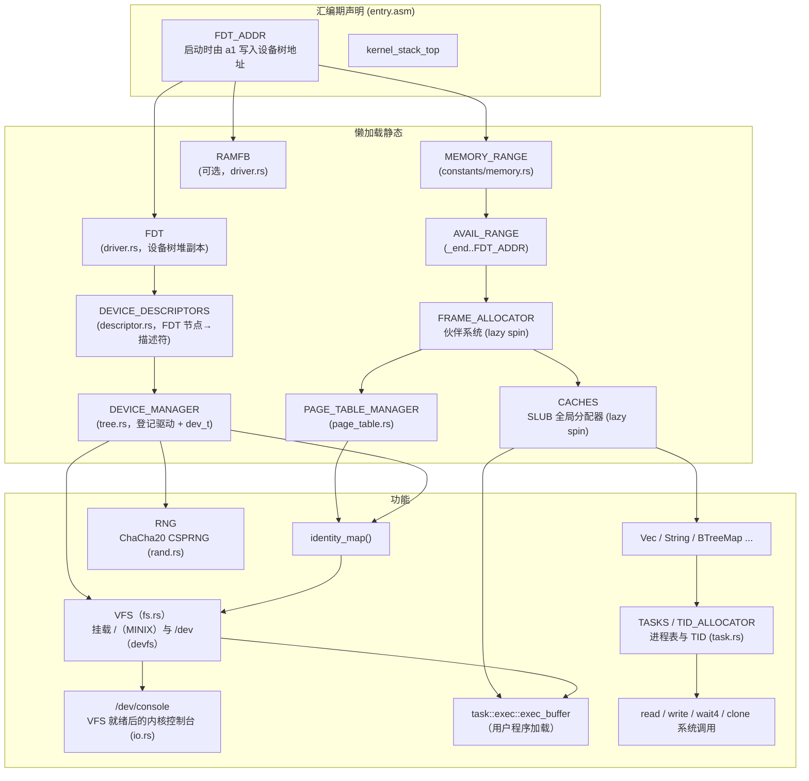

# Athera

一个用 Rust 编写的简易 RISC-V 64 操作系统。

## 特性

- 目标平台：`riscv64gc-unknown-none-elf`，QEMU `virt` 机型（`config.toml` 中 `smp = "UP"`；`smp` feature 仅实验性启动 hart 1 进入 `wfi` 循环，尚未实现真正的多核调度）
- 通过 SBI 与底层交互（base / time / ipi / rfence / hsm / srst / legacy / dbcn）
- UART 驱动：ns16550a，基于设备树自动探测，登记进设备管理器
- 块设备驱动：virtio-blk（MMIO 模式，含 virtio-mmio 传输层、链式握手状态机与通用 `VirtioDevice` 抽象）
- 熵源驱动：virtio-rng（MMIO 模式，为随机数提供真随机种子）
- 显示驱动：ramfb（QEMU RamFB，经 fw_cfg 的 `etc/ramfb` 文件下发帧缓冲配置；帧缓冲为 32bpp XRGB8888，`WIDTH x HEIGHT = 1024x768`，含 `clear` / `fill_rect` / `blit` / `draw_color_card` 绘制原语），并附带 `driver/fw_cfg.rs` 的 fw_cfg MMIO/DMA 驱动。`scripts/start.py` 的 `-b/--gui` 会添加 `-display gtk -device ramfb -serial stdio`
- 随机数：`athera-rand` 提供 ChaCha20 CSPRNG，内核全局 `RNG` 经 virtio-rng 种子化（无设备时回退固定种子并告警）
- 设备模型：`driver/descriptor.rs` 把设备树节点解析为统一描述符（compatible / reg / irq / 属性），`driver/tree.rs` 的设备管理器（`DEVICE_MANAGER`）按描述符登记驱动并分配 Linux 兼容的 `dev_t` 设备号（`Did`：12 位主号 + 20 位次号），`ManagedBlockDevice` 为文件系统提供稳定的块设备句柄
- MINIX 文件系统：启动时从 virtio-blk 读取 MINIX V1 文件系统（超级块、inode、目录项），按路径查找并执行 `/bin/init`、`/bin/fork`、`/bin/mmap_test`、`/bin/print_args`（带完整 argv/envp）等用户程序
- VFS：`fs/vfs.rs` 提供统一文件系统接口——`FileSystem`（路径级）与 `FileOps`（文件对象级）trait、`OpenFlags` / `Stat` / `DirEntry` 等元数据、内存超级块 / inode / 目录项缓存、挂载表与最长前缀路径分发；启动时挂载 `/`（MINIX）与 `/dev`（devfs）
- 设备文件系统：`fs/devfs.rs` 提供 `/dev/null`、`/dev/zero`、`/dev/console`、`/dev/vda` 等静态设备节点；内核控制台在 VFS 就绪后切换到 `/dev/console`，`read`/`write` 系统调用经每进程 fd 表 → VFS → 设备管理器完成
- 内存管理：恒等映射页表、内核/用户地址空间分离（Sv39）、伙伴系统物理页帧分配器、SLUB 全局分配器
- 陷阱处理与用户态上下文恢复（`TrapContext` / `restore_context`），S 模式定时器中断（10 Hz），用户态 `ecall` 分派到系统调用处理
- ELF 加载器：解析 ELF64 程序头，逐段拷贝 `PT_LOAD` 并建立用户映射与栈（`task/exec.rs`）
- 可执行格式路由（binfmt）：基于前缀树的魔数注册表，支持 ELF（`\x7fELF`）与 shebang（`#!`）两种格式；shebang 解析器实现 POSIX shell 最小子集（引号、转义、续行），重组 argv 后重新路由执行
- MBR 分区表：支持解析主引导记录（MBR）的 4 个分区表项，包含分区类型（FAT12/NTFS/Linux/EFI 等 80+ 种）、LBA 起始扇区与扇区数
- 用户态进程管理与系统调用（read / write / exit / reboot / clone / wait4 / execve / mmap / munmap / mremap，调用号对齐 Linux asm-generic ABI）；`read` / `write` / `wait4` / `execve` 传入的用户指针会先经地址空间校验（越界返回 `EFAULT`）；每进程 `fd_table` 默认把 0/1/2 都连接到串口（`/dev/console`）
- TID 分配器（`athera-id-alloc`）
- 同步原语：`SpinLock`（关中断自旋锁）/ `RwLock`（写优先读写自旋锁）/ `OnceLock` / `LazyLock`（懒加载静态）/ `PerCpu`（每 hart 存储）
- 日志宏：`trace!` / `debug!` / `info!` / `warn!` / `error!`
- 构建时配置（`config.toml`）与可选 `halt_directly` feature（停机时直接经 SBI 关机）

## 工作区结构

```
athera/                       # 内核（根 crate）+ 工作区
├── Cargo.toml                # 内核包与 workspace 定义
├── src/
│   ├── main.rs               内核入口（_start 调用 main）
│   ├── entry.asm             启动汇编（_start / 内核栈 / FDT_ADDR / trap_entry / hart_entry）
│   ├── arch.rs               架构模块根
│   ├── arch/riscv64.rs       RISC-V 模块根（wfi / fence.i / sfence.vma / hart_id / ebreak）
│   ├── arch/riscv64/
│   │   ├── boot.rs           启动编排（start_default_programs：经 binfmt 从 VFS 加载并执行用户程序）
│   │   ├── registers.rs      寄存器抽象根
│   │   │   └── registers/    csr.rs / gpr.rs / values.rs
│   │   ├── sbi.rs            SBI 封装（base / time / ipi / rfence / hsm / srst / legacy / dbcn）
│   │   └── trap.rs           陷阱处理、定时器与用户态上下文切换
│   ├── binfmt.rs               可执行格式路由（binfmt：ELF / shebang 魔数注册与分发）
│   ├── binfmt/                 binfmt 子模块
│   │   └── elf.rs              ELF 结构定义（ElfHeader / ProgramHeader / SectionHeader）
│   ├── constants.rs / constants/   编译期常量（memory / symbols / task / cpu / fs / uname / virtio）
│   ├── driver.rs             设备驱动模块根（RAMFB / SYSTEM_MEMORY / FDT 静态）
│   ├── driver/
│   │   ├── descriptor.rs     FDT 节点描述符（Descriptor / Region）
│   │   ├── device.rs         设备抽象（Resource / DeviceInfo / mmio_regs!）
│   │   ├── traits.rs         Device / CharDevice / BlockDevice / ReadAt / WriteAt / Whence
│   │   ├── tree.rs           设备管理器（DEVICE_MANAGER / dev_t / Did / ManagedBlockDevice）
│   │   ├── reboot.rs         reboot 实现（SBI srst / hsm）
│   │   ├── ns16550a.rs       UART 驱动
│   │   ├── fw_cfg.rs         fw_cfg（QEMU firmware config）MMIO/DMA 驱动
│   │   ├── ramfb.rs          ramfb 显示驱动（1024x768 XRGB8888，含绘制原语）
│   │   ├── memory.rs         内存区域探测
│   │   ├── virtio_blk.rs     virtio-blk 驱动
│   │   ├── virtio_rng.rs     virtio-rng 熵源驱动
│   │   ├── virtio_mmio.rs    virtio-mmio 传输层（VirtioDevice trait / VirtqCfg）
│   │   └── virtio_mmio/      virtio-mmio 子模块
│   │       ├── handshake.rs  链式握手状态机
│   │       └── queue.rs      虚拟队列
│   ├── fs.rs                 文件系统模块根（VFS / devfs / minix，公共 Path / FileType / Mode）
│   ├── fs/
│   │   ├── path.rs           路径类型（Path / PathBuf / Component）
│   │   ├── types.rs          文件类型与 mode（FileType / Mode / S_IFMT）
│   │   ├── mbr.rs            MBR 分区表（MbrSector / MbrPartitionEntry / PartitionType）
│   │   ├── vfs.rs            VFS 统一接口（FileSystem / FileOps / 挂载表 / 最长前缀分发）
│   │   │   └── vfs/file_ops.rs  FileOps trait（read / write / read_at / write_at / seek / ioctl / read_dir）
│   │   ├── devfs.rs          设备文件系统（/dev/null / zero / console / vda）
│   │   │   └── devfs/        pseudo.rs / uart.rs / virtio_blk.rs（各节点的 FileOps）
│   │   ├── minix.rs          MINIX V1 文件系统（MinixFs 核心 + MinixVfs 适配器）
│   │   └── minix/            MINIX V1 子模块
│   │       ├── types.rs      磁盘结构（DiskSuperBlock / DiskInode / DirEntryRaw / 魔数）
│   │       ├── dir.rs        目录项与按需读取迭代器（DirEntries）
│   │       ├── file.rs       打开的文件（File 读写）
│   │       ├── write.rs      写路径（创建/删除、硬链接、符号链接、目录）
│   │       └── open.rs       目录读取与路径解析（open / resolve_path）
│   ├── mm.rs                 内存管理模块根
│   ├── mm/
│   │   ├── address.rs        地址位域抽象（Sv39）
│   │   ├── frame.rs          物理页帧句柄（Frame）
│   │   ├── allocator.rs      伙伴系统、SLUB 全局分配器
│   │   │   └── allocator/    buddy.rs / slub.rs / intrusive_list.rs
│   │   ├── page_table.rs     页表（内核/用户地址空间、identity_map、PAGE_TABLE_MANAGER）
│   │   │   └── page_table/   entry.rs / handle.rs
│   ├── rand.rs               全局随机源（ChaCha20 CSPRNG）
│   ├── sync.rs / sync/       SpinLock / RwLock / OnceLock / LazyLock / PerCpu
│   ├── task.rs               进程管理（CURRENT_TASK / Task 任务控制块 / TASKS 任务表 / TID 分配器 / clone_task / MemorySet）
│   ├── task/
│   │   ├── exec.rs           ELF 用户程序加载执行（load_elf / exec_buffer / kernel_execve，含 fd_table 初始化）
│   │   ├── process.rs        进程生命周期与 fd 服务（exit / wait4 / read_fd / write_fd）
│   │   └── scheduler.rs      任务切换（save_current / switch）
│   ├── syscall.rs            系统调用处理（handle，含用户指针校验）
│   │   └── syscall/abi.rs    系统调用号、错误码与用户态 ABI 类型
│   ├── io.rs                 控制台输出层（print!/println! / getchar，VFS 就绪前走 SBI）
│   ├── log.rs                分级日志（trace!/debug!/info!/warn!/error!）
│   ├── macros.rs             宏定义（bits! / numeric! / array_struct!）
│   └── error.rs              错误类型
├── athera-userland/          用户程序（工作区成员）
│   ├── src/
│   │   ├── bin/              init.rs / hello_world.rs / add.rs / sort.rs / panic.rs /
│   │   │                    quick_sort.rs / fork.rs / heap.rs / conway.rs / mmap_test.rs /
│   │   │                    print_args.rs / run.rs
│   │   ├── lib.rs            入口 _start
│   │   ├── syscall.rs        用户态 ecall 封装
│   │   ├── stdio.rs          print!/println!（经 write 系统调用）
│   │   ├── alloc.rs          用户态堆分配器（talc + mmap/mremap/munmap，不预留内存）
│   │   ├── panic.rs
│   │   └── linker.ld
│   └── build.rs
├── crates/                   工作区子 crate
│   ├── athera-macros/        内核属性/派生宏与编译期常量（const_val / lazy / spin / Id）
│   ├── athera-macros-impl/   proc-macro crate（const_val / lazy / spin / Id）
│   ├── athera-id-alloc/      ID 分配器（用于 TID / dev_t）
│   ├── athera-bitmap/        no_std 定长位图（空闲位查找 / 按位操作）
│   └── athera-rand/          no_std 随机数库（ChaCha20 / xoshiro256**）
├── linker.ld                内核链接脚本
├── config.toml              构建时配置
├── build.rs
└── scripts/
    ├── usr                 用户程序管理：add / rm / put（写入 MINIX 镜像 /bin/）
    └── start.py            QEMU 启动脚本
```

## 构建与运行

依赖：

- Rust nightly（edition 2024）
- `qemu-system-riscv64`

构建并启动（用户程序先写入 MINIX 镜像，再由内核从磁盘加载）：

```bash
# 构建用户程序并写入 MINIX 镜像
./scripts/usr put

# 构建内核并启动
cargo build --release
./scripts/start.py --blk resources/minix.qcow2 --random
```

可选 feature：

- 启用 `halt_directly` 后，`kernel_halt()` 会直接通过 SBI 关机而不是空转：

```bash
cargo build --release --features halt_directly
```

- 启用 `smp` 后，内核会尝试通过 SBI HSM 启动 hart 1（实验性）：

```bash
cargo build --release --features smp
./scripts/start.py --cpus 2 --blk resources/minix.qcow2 --random
```

调试构建（`debug_assertions`）默认日志级别为 `TRACE`，发布构建为 `INFO`。

`scripts/start.py` 支持长参数和短参数：

| 选项 | 作用 |
| ---- | ---- |
| `-c`, `--cpus NUM` | 设置 CPU 核数，默认 `1` |
| `-k`, `--kernel FILE` | 指定内核 ELF |
| `-M`, `--machine NAME` | 指定 QEMU machine，默认 `virt` |
| `-q`, `--qemu FILE` | 指定 QEMU 程序 |
| `--disk-format FMT` | 设置磁盘格式，默认 `qcow2` |
| `-d`, `--blk FILE` | 挂载 virtio-blk MMIO 磁盘 |
| `-p`, `--pci-blk FILE` | 挂载 virtio-blk PCI 磁盘 |
| `-r`, `--random` | 添加 virtio-rng（MMIO 熵源）设备 |
| `-b`, `--gui` | 使用 GTK 显示（`-display gtk` + ramfb） |
| `-s`, `--gdb` | 启用 GDB 调试（`-s -S`） |
| `-i`, `--int-debug` | 输出中断日志 |
| `-m`, `--mmu-debug` | 输出 MMU 日志 |
| `-t`, `--trace EVENT` | 添加 QEMU trace 事件，可重复指定 |
| `--no-trace` | 禁用默认 QEMU trace 事件 |
| `-T`, `--timeout SECONDS` | 运行超时时间，默认 `30`，到点自动终止 QEMU |
| `--no-timeout` | 禁用超时，一直运行（`--gdb` 时自动禁用） |
| `-h`, `--help` | 显示帮助 |

`--blk` 和 `--pci-blk` 互斥；`--random` 必须与其中一个磁盘选项一起使用，保证 virtio-blk 仍是第一个 `virtio,mmio` 节点。也可以在 `--` 后追加任意 QEMU 参数。

脚本默认在 `30` 秒后自动终止 QEMU（退出码 `124`），避免长时间挂起；可用 `-T/--timeout` 调整时长或 `--no-timeout` 禁用。`--gdb` 模式会自动禁用超时。

示例：

```bash
./scripts/start.py --cpus 2 --blk resources/minix.qcow2 --random
./scripts/start.py -c 2 -d resources/minix.qcow2 -m -i
./scripts/start.py --pci-blk resources/disk.qcow2
./scripts/start.py --gdb --no-trace
./scripts/start.py -T 60 -d resources/minix.qcow2
```

## 显示（ramfb）

QEMU 11 的 ramfb 通过 fw_cfg 下发帧缓冲配置。`driver/ramfb.rs` 的 `Ramfb::probe`
探测 fw_cfg 与 `etc/ramfb` 后，分配 1024x768 的 32bpp 帧缓冲并用 DMA 写配置；
驱动以 `driver.rs` 的 `RAMFB` 懒加载静态暴露，首次访问时探测。驱动提供
`clear` / `fill_rect` / `blit` / `draw_color_card`（SMPTE 75% 彩条 / 灰阶 /
色相渐变）等绘制原语，供上层显示应用调用。

以 GUI 模式运行：

```bash
cargo build --release
./scripts/start.py -b -d resources/minix.qcow2
```

> 注意：此前“色卡 + 磁盘图片轮播”的启动期死循环演示已不在代码库中（无
> `display.rs`），ramfb 目前只负责探测与提供绘制原语，不在启动流程中主动绘制。

## MINIX 文件系统

内核启动时通过 VFS 从 virtio-blk 读取 MINIX V1 文件系统（`src/fs/minix.rs`）：解析
超级块（`DiskSuperBlock`）、磁盘 inode（`DiskInode`）与目录项（`DirEntryV1_14` /
`DirEntryV1_30`，根据魔数 `0x137F` / `0x138F` 区分文件名长度 14 / 30），通过
`MinixFs::open` 按路径逐级查找并顺序读取文件内容，再经 binfmt 按魔数路由（ELF /
shebang）加载执行。写路径支持创建文件（`create_file`）、读写（`File::write` / `write_at`，
自动分配数据块并维护直接/一级/二级间接块），inode 与数据块位图用 `athera-bitmap`
的 `BitMapView` 零拷贝维护（`alloc_inode` / `free_inode` / `alloc_zone` /
`free_zone`），并支持硬链接（`link`）、删除（`unlink` / `remove`，链接数归零时释放
数据块与 inode）、目录创建/删除（`create_dir` / `remove_dir`，仅空目录）与符号链接
（`symlink`，目标路径存放在数据块中）；`open` 解析路径时自动解引用符号链接（含嵌套
与相对/绝对目标，循环检测上限 40 跳）；路径类型 `Path` / `PathBuf` 仿标准库
（`parent` / `file_name` / `extension` / `join` / `components` / `push` / `pop` 等，
现位于 `src/fs/path.rs`），打开的文件 `File` 携带路径并支持 `path()` / `name()`；
写入结果可通过 `fsck.minix` 校验。

`MinixVfs` 把 MINIX 的路径文件接口适配为 VFS `FileSystem`：通过 VFS 挂载到 `/`
（`fs::init()`），并实现按路径打开、`stat` 与读写（`MinixFileOps` 在 `FileOps`
内部按路径重新打开文件并维护偏移）。

> 注意：`MinixVfs` 支持按路径打开、`stat` 与对已存在文件的读写（`MinixFileOps`
> 提供 `read_at` / `write_at` / `seek`），但路径级的目录/链接操作（`mkdir` /
> `unlink` / `rmdir` / `rename` / `link` / `symlink` / `readlink`）均返回
> `Unsupported`，创建/删除/链接/符号链接/目录等写路径仍只在 `minix` 库内部实现。
> 此外内核尚未提供 `open`/`creat`/`mkdir`/`link` 等系统调用，用户程序暂时无法
> 直接创建或修改磁盘文件（`read` / `write` 只作用于预置的 fd 0/1/2，即串口）。

启动时会依次加载并执行磁盘上的 `/bin/init`、`/bin/fork`、`/bin/mmap_test`，最后携带
完整 argv 与 envp 执行 `/bin/print_args`；`init` 自身还会 `fork` 子进程并 `execve`
`/bin/sort`。`--blk` 选项挂载的 `resources/minix.qcow2` 即为 MINIX 文件系统镜像。

把用户程序复制到该镜像的 `/bin/` 目录下（依赖 libguestfs 的 `guestfish`，会自动构建 `athera-userland`）：

```bash
./scripts/usr put                  # 构建并写入全部 [[bin]]
./scripts/usr put -n               # 不重新构建，直接用现有 ELF
./scripts/usr put -i disk.img      # 指定其他镜像

`./scripts/usr` 还可用于管理用户程序本身：`./scripts/usr add <name>` 注册
`[[bin]]` 并生成骨架源码，`./scripts/usr rm <name>` 移除注册并删除源码。
```

## 系统调用

系统调用号对齐 Linux asm-generic（riscv64）ABI（完整编号见 `resources/unistd.csv`），出错时按 Linux 约定返回 `-errno`。

| 编号 | 系统调用 | 描述 |
| ---- | -------- | ---- |
| 63   | read     | 从当前进程 fd 读取（fd 0 为串口） |
| 64   | write    | 向当前进程 fd 写入（fd 1/2 为串口） |
| 93   | exit     | 退出用户程序；`pid 1` 退出会触发内核 panic |
| 142  | reboot   | 重启/关机/停机（`RebootCmd::RESTART` / `POWER_OFF` / `HALT`，经 `driver::reboot` 走 SBI）|
| 215  | munmap   | 解除 `[addr, addr + length)` 的匿名映射（`src/mm/memory_map.rs`，`addr` 需页对齐）|
| 216  | mremap   | 重映射（`src/mm/memory_map.rs`：原地收缩/扩张，无法原地扩张时按 `MREMAP_MAYMOVE` / `MREMAP_FIXED` 移动）|
| 220  | clone    | 创建子进程（当前仅实现 fork 语义：深拷贝地址空间与陷阱上下文）|
| 221  | execve   | 执行新程序（读 pathname / argv / envp 后经 `binfmt::route_at` 替换当前进程的地址空间与陷阱上下文）|
| 222  | mmap     | 匿名内存映射（`src/mm/memory_map.rs`，仅支持 `MAP_ANONYMOUS`，`fd` 须为 `-1`）|
| 260  | wait4    | 等待子进程（基础实现：支持 `WNOHANG`，非 `WNOHANG` 时让出 CPU）|

> asm-generic 没有 fork / waitpid，libc 分别以 `clone`（flags 为 `SIGCHLD`）与 `wait4` 实现。`clone` 目前为最小实现（fork 语义，忽略 flags / stack 参数），各部分的克隆由对应类型分别实现：`Frame::try_clone`（物理帧）、`AddressSpaceManager::clone`（页表）、`MemorySet::try_clone`（内存集，映射支持多段物理帧）、`TrapContext::clone_child`（子进程现场）与 `Task::try_clone`，由 `task::clone_task`（`src/task.rs`）组合并登记子任务。子进程退出后由 `exit` 将其移交给 `init`（pid 1）收养。
>
> `execve` 由 binfmt 模块实现：系统调用层读取并校验用户指针（`read_user_cstr` / `read_user_string_array`，单参数上限 4096 字节），`binfmt::route_at` 对当前任务按魔数路由（ELF 或 shebang），成功后替换 `memory_set` / `trap_context` 并让出 CPU（不返回调用者）；失败按 binfmt 错误映射为 `EACCES` / `ENOEXEC` / `ENOENT` 等 errno。内核侧 `task::exec::kernel_execve` 提供同等能力供启动编排使用。
>
> `mmap` / `munmap` / `mremap` 由 `src/mm/memory_map.rs` 实现，仅支持匿名映射：`mmap` 从用户栈下方按页查找空闲区间（`MAP_FIXED` 替换重叠映射、`MAP_FIXED_NOREPLACE` 冲突返回 `EEXIST`），`munmap` 对部分重叠的映射按页拆分重建，`mremap` 任意尺寸变化都会重建物理帧并保留内容（收缩保持起始地址，扩张无法原地进行时按 `MREMAP_MAYMOVE` / `MREMAP_FIXED` 移动）；`PROT_NONE` 不建立页表项、仅在映射表中登记（访问时按缺页异常处理），与 Linux riscv 一致地给所有可访问映射置读位（RISC-V 硬件要求叶项 `R=1` 或 `X=1`）。
>
> `read` / `write` 通过每进程的 `fd_table`（`Vec<File>`）查表，再经 VFS 的 `File`（`/dev/console` → 设备管理器 → UART）读写；传入的用户缓冲区会先经 `validate_user_range` 校验是否落在当前任务的合法映射内，越界返回 `EFAULT`（`wait4` 的 `status` / `rusage` 输出指针同理）；`wait4` 的 `WNOHANG` 分支已实现；非 `WNOHANG` 分支会把父进程置为 `Waiting` 并让出 CPU，但当前缺少子进程退出时唤醒父进程的逻辑，阻塞等待并不完整。另外，文件系统的创建/删除/链接/目录等操作目前只在 MINIX 库层实现，尚未提供对应的系统调用。

## 初始化依赖

内核大量使用 `LazyLock`（经 `athera-macros` 的 `#[lazy]` / `#[lazy(spin)]` 宏生成）实现懒加载静态。
各静态首次通过 `.force()` 访问时按需初始化，其依赖关系如下：



- **汇编期声明**：`entry.asm` 中 `_start` 在 `.data`/`.bss` 段预留了 `FDT_ADDR` 与内核启动栈；`FDT_ADDR` 在启动时由寄存器 `a1` 写入设备树物理地址，供 Rust 侧作为 `extern` 符号读取。用户栈与 virtio 队列区由内核在后续运行时动态分配。
- `MEMORY_RANGE` 与 `driver.rs` 中的 `RAMFB` / `SYSTEM_MEMORY` 均依赖启动时由汇编写入的 `FDT_ADDR`（设备树地址）。`FDT` 初始化完成后会把设备树拷贝进堆中并把 `FDT_ADDR` 指向新副本，同时把原设备树所占物理内存归还给伙伴系统。
- `DEVICE_DESCRIPTORS` 基于 `FDT` 副本解析全部设备树节点为统一描述符（`Descriptor`）；`DEVICE_MANAGER` 据此登记 UART / virtio-blk / virtio-rng 驱动并分配 Linux 兼容的 `dev_t` 设备号。
- `FRAME_ALLOCATOR`（伙伴系统）以 `AVAIL_RANGE`（内核末尾 `_end` 到 `FDT_ADDR`）作为可用物理页范围。
- `ADDRESS_SPACE_MANAGER` 与 `CACHES`（SLUB 全局分配器）均需先分配物理页帧，故依赖 `FRAME_ALLOCATOR`。
- 一旦 `CACHES` 就绪，`Vec` / `String` / `BTreeMap` 等 `alloc` 结构以及基于它们的 `TASKS` 进程表、`TID_ALLOCATOR` 方可使用。
- `RNG`（`rand.rs`）首次访问时用 `DEVICE_MANAGER` 中登记的熵源（virtio-rng）提供的真随机字节种子化 ChaCha20 CSPRNG；若没有 virtio-rng 设备则回退固定种子并打印警告。
- VFS 与文件系统：`identity_map()` 完成后，`main` 调用 `fs::init()`——从 `DEVICE_MANAGER` 取得块设备句柄（`ManagedBlockDevice`），读 MINIX 超级块（偏移 1024）、根 inode 与目录项，把 `MinixVfs` 挂载到 `/`、`DevFs` 挂载到 `/dev`。随后 `fs::enable_vfs_console()` 让 `io.rs` 的控制台输出从 SBI legacy 切换到 `/dev/console`，最后 `arch::riscv64::boot::start_default_programs()` 从磁盘加载并执行用户程序。
- 定时器：`main` 启动时以及每次 S 模式定时器中断都会调用 `set_next_timer()` 重设 `stimecmp`（10 Hz），实现周期性的定时器中断。
- 多核：启用 `smp` feature 时，`main` 会调用 `hart_start` 启动 hart 1（实验性）。

## 许可证

GPL-3，详见 [LICENSE](LICENSE)。
