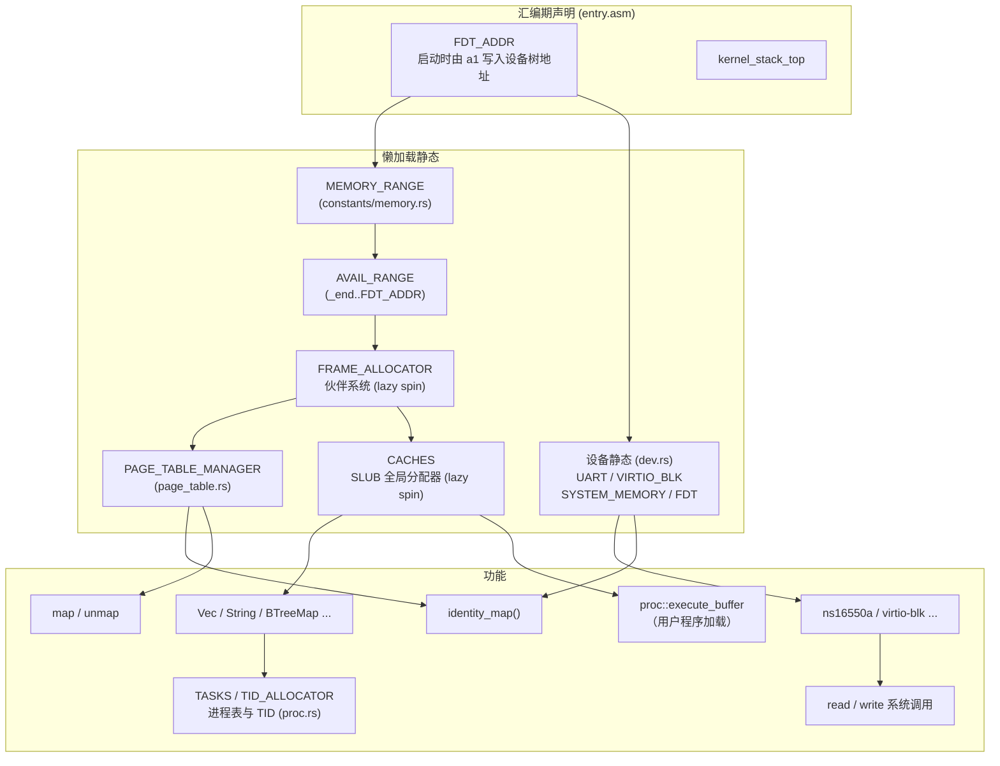

# Athera

一个用 Rust 编写的简易 RISC-V 64 操作系统。

## 特性

- 目标平台：`riscv64gc-unknown-none-elf`，QEMU `virt` 机型
- 通过 SBI 与底层交互（含 srst 系统复位、hsm 停止）
- UART 驱动：ns16550a，基于设备树自动探测
- 块设备驱动：virtio-blk（MMIO 模式，含 virtio-mmio 传输层与链式握手状态机）
- 内存管理：等值映射页表、内核/用户地址空间分离（Sv39）、伙伴系统物理页帧分配器、SLUB 全局分配器
- 陷阱处理与用户态上下文恢复（`TrapContext` / `restore_context`）
- ELF 加载器（支持 32/64 位、大小端，用户程序经 `include_bytes!` 内嵌）
- 用户态进程管理与 ecall 系统调用（read/write/exit/reboot）
- TID 分配器（`athera-id-alloc`）
- 同步原语：`SpinLock`（关中断自旋锁）/ `OnceLock` / `LazyLock`（懒加载静态）/ `PerCpu`（每 hart 存储）
- 日志宏：`debug!` / `info!` / `error!`
- 构建时配置（`config.toml`）

## 工作区结构

```
athera/                       # 内核（根 crate）
├── src/
│   ├── arch/               RISC-V 相关
│   │   ├── registers/      csr / gpr / values（寄存器抽象）
│   │   └── sbi.rs          SBI 封装（srst、hsm 等）
│   ├── constants/          常量模块
│   │   ├── memory.rs       内存常量与懒加载范围（MEMORY_RANGE 等）
│   │   ├── symbols.rs      链接器符号（_end / trap_entry / FDT_ADDR）
│   │   ├── elf.rs          内嵌用户程序 ELF
│   │   ├── task.rs         任务常量（TID_MAX）
│   │   ├── uname.rs        版本信息
│   │   └── virtio.rs       virtio 常量
│   ├── dev/                设备驱动
│   │   ├── device.rs       设备抽象（MMIO Resource / Device / mmio_regs!）
│   │   ├── ns16550a.rs     UART 驱动
│   │   ├── memory.rs       内存区域探测
│   │   ├── virtio_blk.rs   virtio-blk 驱动
│   │   └── virtio_mmio/    virtio-mmio 传输层
│   │       ├── handshake.rs  链式握手状态机
│   │       └── queue.rs      虚拟队列
│   ├── mem/                内存管理
│   │   ├── addr.rs         地址位域抽象（Sv39）
│   │   ├── alloc_page.rs   物理页帧句柄（AllocPage）
│   │   ├── allocators/     伙伴系统、SLUB 全局分配器、侵入式链表
│   │   └── page_table/     页表（内核/用户地址空间）
│   │       └── handle.rs   页表句柄
│   ├── entry.asm           启动汇编
│   ├── trap.rs             陷阱处理与用户态上下文
│   ├── syscall.rs          系统调用
│   ├── proc.rs             进程管理
│   │   ├── task.rs         任务控制块、TID 分配与任务表
│   │   └── exec.rs         ELF 用户程序加载执行
│   ├── elf.rs              ELF 结构定义
│   ├── io.rs               格式化输出（print!/println!）
│   ├── log.rs              分级日志（debug!/info!/error! 等）
│   ├── locks.rs            同步原语模块
│   │   ├── spin.rs         SpinLock（关中断自旋锁）
│   │   ├── once.rs         OnceLock（一次性初始化）
│   │   ├── lazy.rs         LazyLock（懒加载静态）
│   │   └── per_cpu.rs      PerCpu（每 hart 存储）
│   ├── macros.rs           宏定义（bits!/numeric!/mmio_regs!/array_struct!）
│   ├── error.rs            错误类型
│   └── main.rs             内核入口
├── athera-userland/         用户程序（子 crate）
│   ├── src/
│   │   ├── bin/            hello_world.rs / add.rs
│   │   ├── lib.rs          入口 _start
│   │   ├── syscall.rs      用户态 ecall 封装
│   │   ├── panic.rs
│   │   └── linker.ld
│   └── build.rs
├── athera-const/            编译期常量与属性宏（const_val / lazy / spin）
├── athera-const-macros/     proc-macro crate（const_val / lazy / spin）
├── athera-id-alloc/         ID 分配器（用于 TID）
├── linker.ld               内核链接脚本
├── config.toml             构建时配置
├── build.rs
└── start.sh                QEMU 启动脚本
```

## 构建与运行

依赖：

- Rust nightly（edition 2024）
- `qemu-system-riscv64`

构建并启动（用户程序 ELF 会在编译期通过 `include_bytes!` 内嵌进内核，须先构建）：

```bash
# 先构建用户程序
cargo build -p athera-userland --release

# 构建内核并启动
cargo build --release
./start.sh
```

`start.sh` 选项：

| 选项 | 作用 |
| ---- | ---- |
| `-s` | 启用 GDB 调试（`-s -S`）|
| `-i` | 输出中断日志 |
| `-m` | 输出 MMU 日志 |
| `-p` | 挂载 virtio-blk PCI 磁盘（`resources/disk.qcow2`）|
| `-b` | 使用 GTK 显示（`-display gtk` + ramfb）|
| `-d` | 挂载 virtio-blk MMIO 磁盘 |

示例：

```bash
./start.sh -p          # 带 PCI 块设备启动
./start.sh -s -i       # 调试 + 中断日志
./start.sh -b -d       # GTK 图形界面 + MMIO 磁盘
```

## 系统调用

| 编号 | 系统调用 | 描述 |
| ---- | -------- | ---- |
| 63   | read     | 从 UART 读取 |
| 64   | write    | 向 UART 写入 |
| 93   | exit     | 退出用户程序 |
| 95   | waitpid  | 等待子进程（未实现）|
| 142  | reboot   | 重启/关机/停机 |
| 220  | fork     | 创建子进程（未实现）|
| 221  | exec     | 执行新程序（未实现）|


## 初始化依赖

内核大量使用 `LazyLock`（经 `athera-const` 的 `#[lazy]` / `#[lazy(spin)]` 宏生成）实现懒加载静态。
各静态首次通过 `.force()` 访问时按需初始化，其依赖关系如下：



- **汇编期声明**：`entry.asm` 中 `_start` 在 `.data`/`.bss` 段预留了 `FDT_ADDR`、内核/用户栈及 virtio 队列区；`FDT_ADDR` 在启动时由寄存器 `a1` 写入设备树物理地址，供 Rust 侧作为 `extern` 符号读取。
- `MEMORY_RANGE` 与 `dev.rs` 中的 `UART` / `VIRTIO_BLK` / `SYSTEM_MEMORY` / `FDT` 均依赖启动时由汇编写入的 `FDT_ADDR`（设备树地址）。
- `FRAME_ALLOCATOR`（伙伴系统）以 `AVAIL_RANGE`（内核末尾 `_end` 到 `FDT_ADDR`）作为可用物理页范围。
- `PAGE_TABLE_MANAGER` 与 `CACHES`（SLUB 全局分配器）均需先分配物理页帧，故依赖 `FRAME_ALLOCATOR`。
- 一旦 `CACHES` 就绪，`Vec` / `String` / `BTreeMap` 等 `alloc` 结构以及基于它们的 `TASKS` 进程表、`TID_ALLOCATOR` 方可使用。

## 许可证

GPL-3，详见 [LICENSE](LICENSE)。