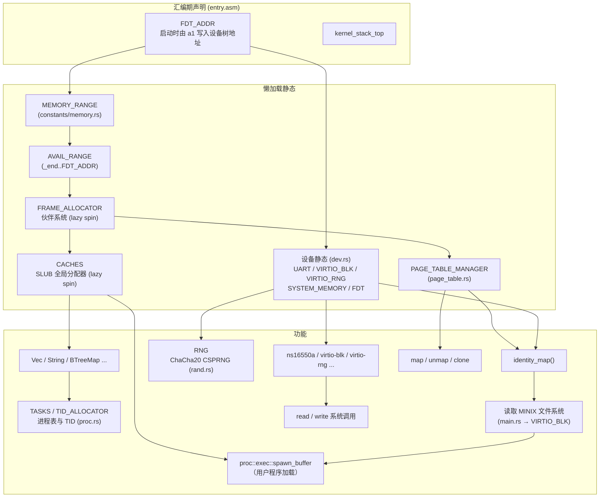

# Athera

一个用 Rust 编写的简易 RISC-V 64 操作系统。

## 特性

- 目标平台：`riscv64gc-unknown-none-elf`，QEMU `virt` 机型（`config.toml` 中 `smp = "UP"`；`smp` feature 仅实验性启动 hart 1 进入 `wfi` 循环，尚未实现真正的多核调度）
- 通过 SBI 与底层交互（srst 系统复位/重启、hsm 停止/启动 hart、legacy 控制台、DBCN 调试控制台等）
- UART 驱动：ns16550a，基于设备树自动探测
- 块设备驱动：virtio-blk（MMIO 模式，含 virtio-mmio 传输层、链式握手状态机与通用 `VirtioDevice` 抽象）
- 熵源驱动：virtio-rng（MMIO 模式，为随机数提供真随机种子）
- 显示驱动：ramfb（QEMU RamFB，经 fw_cfg 的 `etc/ramfb` 文件下发帧缓冲配置；帧缓冲为 32bpp XRGB8888，`WIDTH x HEIGHT = 1024x768`），并附带 `dev/fw_cfg.rs` 的 fw_cfg MMIO/DMA 驱动。`scripts/start.sh` 的 `-b/--gui` 会添加 `-display gtk -device ramfb -serial stdio`。
- 随机数：`athera-rand` 提供 ChaCha20 CSPRNG，内核全局 `RNG` 经 virtio-rng 种子化（无设备时回退固定种子并告警）
- MINIX 文件系统：启动时从 virtio-blk 读取 MINIX V1 文件系统（超级块、inode、目录项），按路径查找并执行 `/bin/init`、`/bin/hello_world`、`/bin/quick_sort`、`/bin/panic`、`/bin/sort`、`/bin/add`、`/bin/fork` 等用户程序
- VFS 与设备文件系统：`fs/vfs.rs` 定义了统一文件系统接口（当前多为 `todo!()` 占位），`fs/dev_fs.rs` 为设备文件系统占位
- 内存管理：等值映射页表、内核/用户地址空间分离（Sv39）、伙伴系统物理页帧分配器、SLUB 全局分配器
- 陷阱处理与用户态上下文恢复（`TrapContext` / `restore_context`），S 模式定时器中断（10 Hz）
- ELF 加载器：解析 ELF64 程序头，逐段拷贝 `PT_LOAD` 并建立用户映射与栈
- 用户态进程管理与 ecall 系统调用（read / write / exit / reboot / clone / wait4，调用号对齐 Linux asm-generic ABI）
- TID 分配器（`athera-id-alloc`）
- 同步原语：`SpinLock`（关中断自旋锁）/ `RwLock`（写优先读写自旋锁）/ `OnceLock` / `LazyLock`（懒加载静态）/ `PerCpu`（每 hart 存储）
- 日志宏：`trace!` / `debug!` / `info!` / `warn!` / `error!`
- 构建时配置（`config.toml`）与可选 `halt_directly` feature（停机时直接经 SBI 关机）

## 工作区结构

```
athera/                       # 内核（根 crate）
├── src/
│   ├── arch.rs              RISC-V 模块根
│   ├── arch/                RISC-V 相关
│   │   ├── registers/       csr / gpr / values（寄存器抽象）
│   │   └── sbi.rs           SBI 封装（base / time / ipi / rfence / hsm / srst / legacy / dbcn）
│   ├── boot.rs              启动编排（从磁盘加载用户程序）
│   ├── constants.rs         常量模块根
│   ├── constants/           常量模块
│   │   ├── memory.rs        内存常量与懒加载范围（MEMORY_RANGE 等）
│   │   ├── symbols.rs       链接器符号（_end / trap_entry / user_trap_entry / FDT_ADDR）
│   │   ├── task.rs          任务常量（TID_MAX）
│   │   ├── cpu.rs           CPU 相关常量
│   │   ├── fs.rs            文件系统常量
│   │   ├── uname.rs         版本信息
│   │   └── virtio.rs        virtio 常量
│   ├── dev.rs               设备模块根（静态设备集合）
│   ├── dev/                 设备驱动
│   │   ├── device.rs        设备抽象（MMIO Resource / Device / mmio_regs!）
│   │   ├── traits.rs        CharDevice / BlockDevice trait
│   │   ├── ns16550a.rs      UART 驱动
│   │   ├── fw_cfg.rs        fw_cfg（QEMU firmware config）MMIO/DMA 驱动
│   │   ├── ramfb.rs         ramfb 显示驱动（1024x768 XRGB8888，含绘制原语）
│   │   ├── display.rs       显示测试（标准色卡 + 磁盘图片轮播，死循环）
│   │   ├── memory.rs        内存区域探测
│   │   ├── tree.rs          设备树解析辅助
│   │   ├── virtio_blk.rs    virtio-blk 驱动
│   │   ├── virtio_rng.rs    virtio-rng 熵源驱动
│   │   ├── virtio_mmio.rs   virtio-mmio 传输层（VirtioDevice trait / VirtqCfg）
│   │   └── virtio_mmio/     virtio-mmio 子模块
│   │       ├── handshake.rs 链式握手状态机
│   │       └── queue.rs       虚拟队列
│   ├── entry.asm            启动汇编（_start / 内核栈 / FDT_ADDR 声明）
│   ├── fs.rs                文件系统模块根
│   ├── fs/                  文件系统
│   │   ├── minix_fs.rs      MINIX V1 文件系统（模块根：MinixFs 核心 / 位图分配 / 再导出）
│   │   ├── vfs.rs           VFS 统一接口（当前多为占位实现）
│   │   ├── dev_fs.rs        设备文件系统占位
│   │   └── minix_fs/        MINIX V1 子模块
│   │       ├── types.rs      磁盘结构（SuperBlock / DINode / DirEntryRaw / Mode / 魔数）
│   │       ├── path.rs       路径类型（Path / PathBuf / Component）
│   │       ├── dir.rs        目录项与按需读取迭代器（DirEntries）
│   │       ├── file.rs       打开的文件（File 读写）
│   │       ├── write.rs      写路径（创建/删除、硬链接、符号链接、目录）
│   │       └── open.rs       目录读取与路径解析（open / resolve_path）
│   ├── mem.rs               内存管理模块根
│   ├── mem/                 内存管理
│   │   ├── addr.rs          地址位域抽象（Sv39）
│   │   ├── frame.rs         物理页帧句柄（Frame）
│   │   ├── allocators/      伙伴系统、SLUB 全局分配器、侵入式链表
│   │   └── page_table/      页表（内核/用户地址空间）
│   │       └── handle.rs    页表句柄
│   ├── rand.rs              全局随机源（ChaCha20 CSPRNG）
│   ├── sync.rs              同步原语模块根
│   ├── sync/                同步原语
│   │   ├── spin.rs          SpinLock（关中断自旋锁）
│   │   ├── rwlock.rs        RwLock（写优先读写自旋锁）
│   │   ├── once.rs          OnceLock（一次性初始化）
│   │   ├── lazy.rs          LazyLock（懒加载静态）
│   │   └── per_cpu.rs       PerCpu（每 hart 存储）
│   ├── proc.rs              进程管理模块根
│   ├── proc/                进程管理
│   │   ├── task.rs          任务控制块、TID 分配与任务表
│   │   ├── exec.rs          ELF 用户程序加载执行
│   │   └── sched.rs         任务切换
│   ├── trap.rs              陷阱处理与用户态上下文、定时器
│   ├── syscall.rs           系统调用
│   ├── syscall/             系统调用子模块
│   │   ├── abi.rs           系统调用号与错误码
│   │   ├── io.rs            read / write
│   │   ├── process.rs       exit / wait4
│   │   └── reboot.rs        reboot
│   ├── elf.rs               ELF 结构定义
│   ├── io.rs                控制台输出层（print!/println! / getchar）
│   ├── log.rs               分级日志（trace!/debug!/info!/warn!/error!）
│   ├── macros.rs            宏定义（bits!/numeric!/mmio_regs!/array_struct!）
│   ├── error.rs             错误类型
│   └── main.rs              内核入口
├── crates/                  工作区子 crate
│   ├── athera-userland/     用户程序
│   │   ├── src/
│   │   │   ├── bin/         init.rs / hello_world.rs / add.rs / sort.rs /
│   │   │   │              panic.rs / quick_sort.rs / fork.rs / heap.rs
│   │   │   ├── lib.rs       入口 _start
│   │   │   ├── syscall.rs   用户态 ecall 封装
│   │   │   ├── stdio.rs     print!/println!（经 write 系统调用）
│   │   │   ├── panic.rs
│   │   │   ├── alloc.rs     用户态堆分配器
│   │   │   └── linker.ld
│   │   └── build.rs
│   ├── athera-macros/        内核属性/派生宏与编译期常量（const_val / lazy / spin / Id）
│   ├── athera-macros-impl/   proc-macro crate（const_val / lazy / spin / Id）
│   ├── athera-id-alloc/     ID 分配器（用于 TID）
│   ├── athera-bitmap/       no_std 定长位图（空闲位查找 / 按位操作）
│   └── athera-rand/         no_std 随机数库（ChaCha20 / xoshiro256**）
├── linker.ld                内核链接脚本
├── config.toml              构建时配置
├── build.rs
└── scripts/
    ├── put_userland.sh      构建并把用户程序复制到 MINIX 镜像 /bin/
    └── start.sh             QEMU 启动脚本
```

## 构建与运行

依赖：

- Rust nightly（edition 2024）
- `qemu-system-riscv64`

构建并启动（用户程序先写入 MINIX 镜像，再由内核从磁盘加载）：

```bash
# 构建用户程序并写入 MINIX 镜像
./scripts/put_userland.sh

# 构建内核并启动
cargo build --release
./scripts/start.sh --blk resources/minix.qcow2 --random
```

可选 feature：

- 启用 `halt_directly` 后，`kernel_halt()` 会直接通过 SBI 关机而不是空转：

```bash
cargo build --release --features halt_directly
```

- 启用 `smp` 后，内核会尝试通过 SBI HSM 启动 hart 1（实验性）：

```bash
cargo build --release --features smp
./scripts/start.sh --cpus 2 --blk resources/minix.qcow2 --random
```

调试构建（`debug_assertions`）默认日志级别为 `TRACE`，发布构建为 `INFO`。

`scripts/start.sh` 支持长参数和短参数：

| 选项 | 作用 |
| ---- | ---- |
| `-c`, `--cpus NUM` | 设置 CPU 核数，默认 `1` |
| `-k`, `--kernel FILE` | 指定内核 ELF |
| `-M`, `--machine NAME` | 指定 QEMU machine，默认 `virt` |
| `-q`, `--qemu FILE` | 指定 QEMU 程序 |
| `--disk-format FMT` | 设置磁盘格式，默认 `qcow2` |
| `-d`, `--blk FILE` | 挂载 virtio-blk MMIO 磁盘 |
| `-p`, `--pci-blk FILE` | 挂载 virtio-blk PCI 磁盘 |
| `-r`, `--random` | 添加 virtio-rng（MMIO 熵源）设备 |
| `-b`, `--gui` | 使用 GTK 显示（`-display gtk` + ramfb） |
| `-s`, `--gdb` | 启用 GDB 调试（`-s -S`） |
| `-i`, `--int-debug` | 输出中断日志 |
| `-m`, `--mmu-debug` | 输出 MMU 日志 |
| `-t`, `--trace EVENT` | 添加 QEMU trace 事件，可重复指定 |
| `--no-trace` | 禁用默认 QEMU trace 事件 |
| `-h`, `--help` | 显示帮助 |

`--blk` 和 `--pci-blk` 互斥；`--random` 必须与其中一个磁盘选项一起使用，保证 virtio-blk 仍是第一个 `virtio,mmio` 节点。也可以在 `--` 后追加任意 QEMU 参数。

示例：

```bash
./scripts/start.sh --cpus 2 --blk resources/minix.qcow2 --random
./scripts/start.sh -c 2 -d resources/minix.qcow2 -m -i
./scripts/start.sh --pci-blk resources/disk.qcow2
./scripts/start.sh --gdb --no-trace
```

## 显示（ramfb）

QEMU 11 的 ramfb 通过 fw_cfg 下发帧缓冲配置。内核 `dev/ramfb.rs` 探测到
fw_cfg 与 `etc/ramfb` 后，分配 1024x768 的 32bpp 帧缓冲并用 DMA 写配置。

当存在 ramfb 设备时，内核在调度器启动前进入一个死循环（`dev/display.rs`），
绘制标准色卡（SMPTE 75% 彩条 / 灰阶 / 色相渐变）并轮播磁盘上的图片。图片从
MINIX 文件系统的 `/img/card{1..4}.raw`（1024x640 的 XRGB8888 原始像素）加载，
无 ramfb 时回退到正常启动路径。

以 GUI 模式运行并显示：

```bash
./scripts/put_userland.sh -n      # 仅当需要把图片写到 /img 时运行（见下）
cargo build --release
./scripts/start.sh -b -d resources/minix.qcow2
```

> 演示图片需先写入磁盘：把任意 JPEG 缩放到 1024x640 并转成 XRGB8888 原始
> 像素（字节序 B,G,R,X），再用 guestfish 上传到 `/img/card1.raw` 等。
> 本项目演示用的 4 张图来自 `~/Downloads`，由脚本生成。

## MINIX 文件系统

内核启动时从 virtio-blk 读取 MINIX V1 文件系统（`src/fs/minix_fs.rs`）：解析超级块（`SuperBlock`）、磁盘 inode（`DINode`）与目录项（`DirEntryV1_14` / `DirEntryV1_30`，根据魔数 `0x137F` / `0x138F` 区分文件名长度 14 / 30），通过 `MinixFs::open` 按路径逐级查找并顺序读取文件内容，再交给 `proc::exec::spawn_buffer` 加载执行。写路径支持创建文件（`create_file`）、读写（`File::write` / `write_at`，自动分配数据块并维护直接/一级/二级间接块），inode 与数据块位图用 `athera-bitmap` 的 `BitMapView` 零拷贝维护（`alloc_inode` / `free_inode` / `alloc_zone` / `free_zone`），并支持硬链接（`link`）、删除（`unlink` / `remove`，链接数归零时释放数据块与 inode）、目录创建/删除（`create_dir` / `remove_dir`，仅空目录）与符号链接（`symlink`，目标路径存放在数据块中）；`open` 解析路径时自动解引用符号链接（含嵌套与相对/绝对目标，循环检测上限 40 跳）；路径类型 `Path` / `PathBuf` 仿标准库（`parent` / `file_name` / `extension` / `join` / `components` / `push` / `pop` 等），打开的文件 `File` 携带路径并支持 `path()` / `name()`；写入结果可通过 `fsck.minix` 校验。

> 注意：上述写路径（创建/删除/链接/符号链接/目录）目前只在 `minix_fs` 库内部实现；`src/fs/vfs.rs` 的 VFS 分发与 `src/fs/dev_fs.rs` 的设备文件系统尚未完成，内核也还没有提供 `open`/`creat`/`mkdir`/`link` 等系统调用，因此用户程序暂时无法直接创建或修改磁盘文件。

启动时会依次加载并执行磁盘上的 `/bin/init`、`/bin/hello_world`、`/bin/quick_sort`、`/bin/panic`、`/bin/sort`、`/bin/add`、`/bin/fork`。`--blk` 选项挂载的 `resources/minix.qcow2` 即为 MINIX 文件系统镜像。

把用户程序复制到该镜像的 `/bin/` 目录下（依赖 libguestfs 的 `guestfish`，会自动构建 `athera-userland`）：

```bash
./scripts/put_userland.sh              # 构建并写入全部 [[bin]]
./scripts/put_userland.sh -n           # 不重新构建，直接用现有 ELF
./scripts/put_userland.sh -i disk.img  # 指定其他镜像
```

## 系统调用

系统调用号对齐 Linux asm-generic（riscv64）ABI（完整编号见 `resources/unistd.csv`），出错时按 Linux 约定返回 `-errno`。

| 编号 | 系统调用 | 描述 |
| ---- | -------- | ---- |
| 63   | read     | 从 UART 读取 |
| 64   | write    | 向 UART 写入 |
| 93   | exit     | 退出用户程序；`pid 1` 退出会触发内核 panic |
| 142  | reboot   | 重启/关机/停机 |
| 215  | munmap   | 解除映射（`todo!()`，尚未实现）|
| 216  | mremap   | 重映射（`todo!()`，尚未实现）|
| 220  | clone    | 创建子进程（当前仅实现 fork 语义：深拷贝地址空间与陷阱上下文）|
| 221  | execve   | 执行新程序（未实现）|
| 222  | mmap     | 映射内存（`todo!()`，尚未实现）|
| 260  | wait4    | 等待子进程（基础实现：支持 `WNOHANG`，非 `WNOHANG` 时让出 CPU）|

> asm-generic 没有 fork / waitpid，libc 分别以 `clone`（flags 为 `SIGCHLD`）与 `wait4` 实现。`clone` 目前为最小实现（fork 语义，忽略 flags / stack 参数），各部分的克隆由对应类型分别实现：`Frame::try_clone`（物理帧）、`PageTableManager::clone`（页表）、`MemorySet::try_clone`（内存集）、`TrapContext::clone_child`（子进程现场）与 `TaskControlBlock::try_clone`，由 `proc::task::clone_task` 组合并登记子任务。子进程退出后由 `exit` 将其移交给 `init`（pid 1）收养。`execve` / `mmap` / `munmap` / `mremap` 尚未实现，返回 `ENOSYS`。
>
> `wait4` 的 `WNOHANG` 分支已实现；非 `WNOHANG` 分支会把父进程置为 `Waiting` 并让出 CPU，但当前缺少子进程退出时唤醒父进程的逻辑，阻塞等待并不完整。另外，文件系统的创建/删除/链接/目录等操作目前只在 MINIX 库层实现，尚未提供对应的系统调用。

## 初始化依赖

内核大量使用 `LazyLock`（经 `athera-macros` 的 `#[lazy]` / `#[lazy(spin)]` 宏生成）实现懒加载静态。
各静态首次通过 `.force()` 访问时按需初始化，其依赖关系如下：



- **汇编期声明**：`entry.asm` 中 `_start` 在 `.data`/`.bss` 段预留了 `FDT_ADDR` 与内核启动栈；`FDT_ADDR` 在启动时由寄存器 `a1` 写入设备树物理地址，供 Rust 侧作为 `extern` 符号读取。用户栈与 virtio 队列区由内核在后续运行时动态分配。
- `MEMORY_RANGE` 与 `dev.rs` 中的 `UART` / `VIRTIO_BLK` / `VIRTIO_RNG` / `SYSTEM_MEMORY` / `FDT` 均依赖启动时由汇编写入的 `FDT_ADDR`（设备树地址）。`FDT` 初始化完成后会把设备树拷贝进堆中并把 `FDT_ADDR` 指向新副本，同时把原设备树所占物理内存归还给伙伴系统。
- `FRAME_ALLOCATOR`（伙伴系统）以 `AVAIL_RANGE`（内核末尾 `_end` 到 `FDT_ADDR`）作为可用物理页范围。
- `PAGE_TABLE_MANAGER` 与 `CACHES`（SLUB 全局分配器）均需先分配物理页帧，故依赖 `FRAME_ALLOCATOR`。
- 一旦 `CACHES` 就绪，`Vec` / `String` / `BTreeMap` 等 `alloc` 结构以及基于它们的 `TASKS` 进程表、`TID_ALLOCATOR` 方可使用。
- `RNG`（`rand.rs`）首次访问时用 `VIRTIO_RNG` 提供的真随机字节种子化 ChaCha20 CSPRNG；若没有 virtio-rng 设备则回退固定种子并打印警告。
- MINIX 文件系统：`identity_map()` 完成后，`main` 通过 `VIRTIO_BLK` 读取 MINIX 超级块（偏移 1024）、根 inode 与目录项，按路径查找并加载执行磁盘上的用户程序。
- 定时器：`main` 启动时以及每次 S 模式定时器中断都会调用 `set_next_timer()` 重设 `stimecmp`（10 Hz），实现周期性的定时器中断。
- 多核：启用 `smp` feature 时，`main` 会调用 `hart_start` 启动 hart 1（实验性）。

## 许可证

GPL-3，详见 [LICENSE](LICENSE)。
